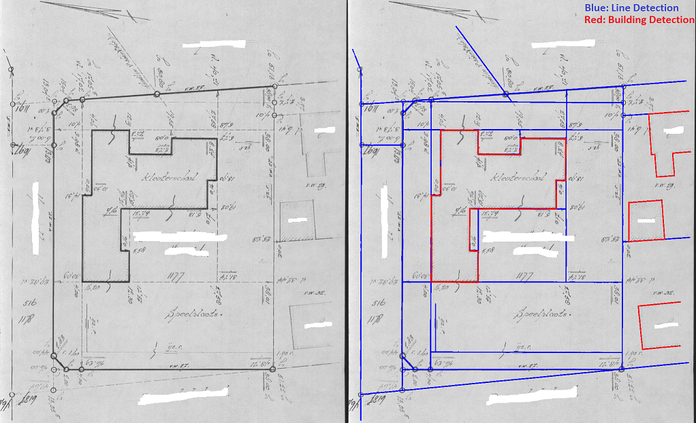

# Line and Building Detection using Binary Segmentation

An end-to-end system which is able to detect lines and buildings in images. The Neural Network is a FCNN variant (U-NET).
This repository is intended to aid in vectorizing field sketches. Mask prediction example using trained model:

Training can be started from train/train.ipynb (For example on Google Colab).
